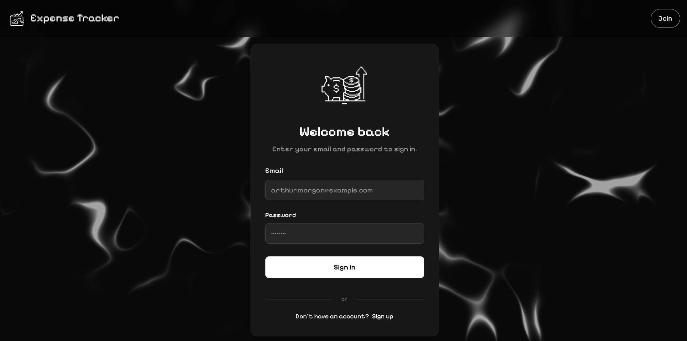
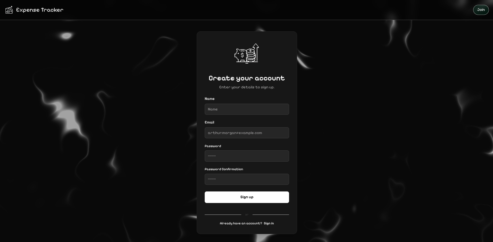
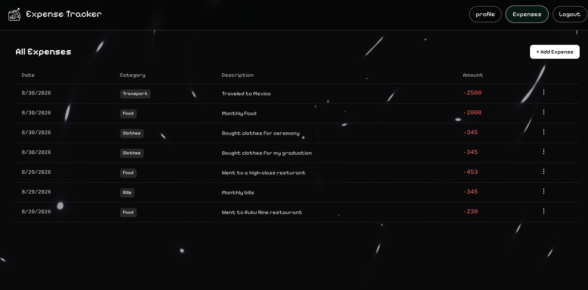
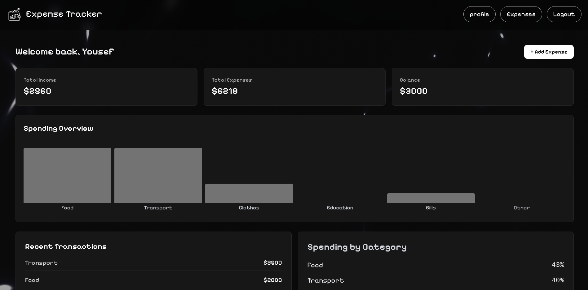
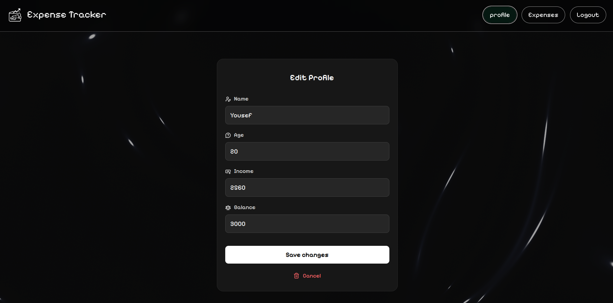

# Expense Tracker

Expense tracking app with authentication, expense management, and category breakdowns.

**Live:** https://expense-tracker-blond-eight-68.vercel.app

## Stack

React · TypeScript · Vite · Tailwind · Zustand
Node.js · Express · PostgreSQL · Prisma · JWT

## Structure

```text
packages/
├── server/
└── web/
```

## Setup

```bash
npm install

cp packages/server/.env.example packages/server/.env
cp packages/web/.env.example packages/web/.env

cd packages/server
npx prisma migrate deploy
cd ../..

npm run dev
```

Web: `http://localhost:5173`
API: `http://localhost:3000`

## Screenshots












## Environment

Server:

```env
DATABASE_URL=
PORT=
NODE_ENV=
AUTH_SECRET=
AUTH_SECRET_EXPIRES_IN=
AUTH_REFRESH=
AUTH_REFRESH_EXPIRES_IN=
CORS_ORIGIN=
```

Web:

```env
VITE_API_URL=
```

## API

- `/api/auth` — authentication and profile
- `/api/expenses` — expense CRUD
- `/api/health` — health check

## Scripts

```bash
npm run dev
npm run build
```
